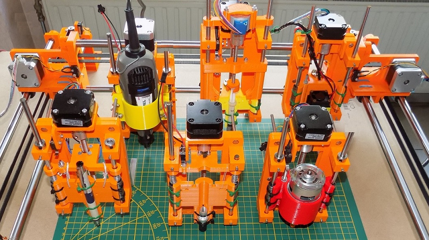

## Z99

Z99 is a multifunctional 4 axis machine.

## Some possibilities of the Z99 are:

- Drawing on screen and large format plot output, up to A3+.
- Plot a PCB with etch resist ink.
- Plot a circuit with conductive ink.
- Plot a large format poster.
- Cut vinyl letters.
- Cut paper.
- Drill holes.
- Mill a PCB.
- Engrave, cut and make a solder pad masks with a laser.

## Installation

Click on the green 'Code' button.

Download InstallZ99.zip.

Extract and execute InstallZ99.exe

## Content

After installation, the subdirectories are:
- \3Dparts: Contains all .scad source code and .stl files.
- \CSharpCode: The C# source code for Visual Studio 2015, 2017, 2022.
- If your Windows system has difficulties to run XYZ.exe, download Visual Studio Community and open the solution \CSharpCode\XYZ.sln. 
- \DemoFiles: HPGL, Gerber, Drill, Gerber, and G-code files.
- \MikrocontrollerCode: PIC microcontroller code and Z99.hex file. 
- \PCB_LayoutAndSchematicDesign: Contains the schematic and PCB layout.
- \WindowsSoftware: the windows software XYZ.exe

## Manual

All documentation for construction and use is in the book :

"Build Your Own Multifunctional 4-Axis CNC Machine"

Edited and printed by https://www.elektor.com

